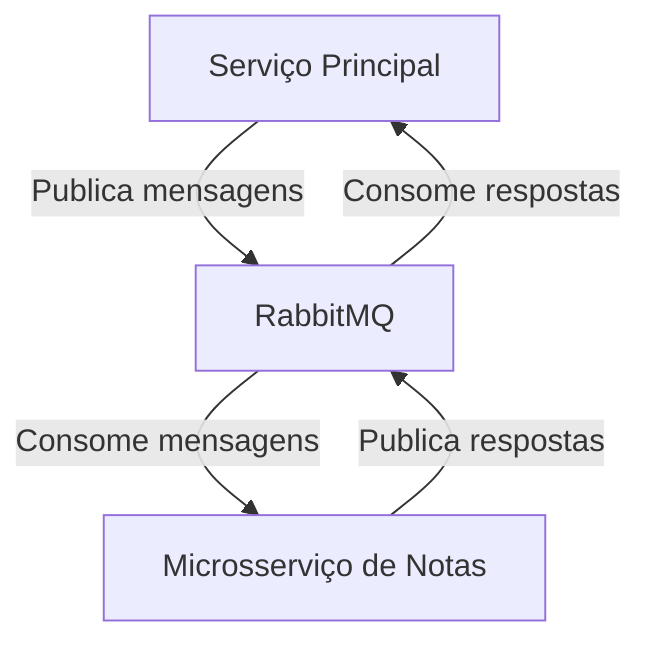
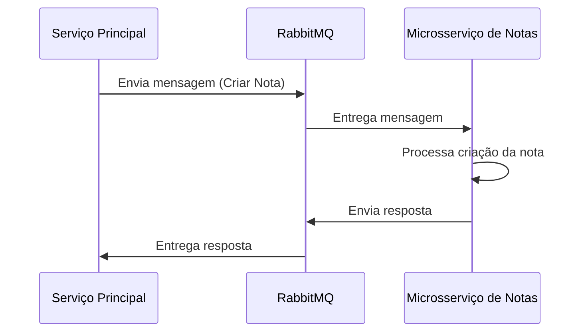

# TP4 - Relatório de Implementação do RabbitMQ no Sistema de Gerenciamento de Projetos

## 1. Introdução

Este relatório detalha a implementação do RabbitMQ como solução de mensageria no Sistema de Gerenciamento de Projetos, 
substituindo a comunicação anterior baseada em REST API entre o serviço principal e o microsserviço de notas.

## 2. Avaliação da Arquitetura orientada a eventos

A Arquitetura Orientada a Eventos (AOE) oferece vantagens significativas em sistemas distribuídos, como desacoplamento entre serviços,
escalabilidade aprimorada e maior flexibilidade para evolução do sistema. Ela é particularmente vantajosa em cenários que exigem processamento 
assíncrono, como sistemas de e-commerce com picos de demanda, plataformas IoT com fluxo constante de dados de sensores, ou aplicações financeiras 
que necessitam de processamento em tempo real. A AOE também facilita a implementação de padrões como CQRS (Command Query Responsibility Segregation) 
e Event Sourcing, permitindo uma melhor separação de responsabilidades e rastreabilidade de mudanças no sistema. 

No entanto, esta arquitetura também apresenta desafios, como aumento da complexidade na gestão e monitoramento de eventos, potencial para inconsistência temporária de dados e necessidade de mecanismos robustos para garantir a ordem e a entrega de eventos. Além disso, a depuração em sistemas orientados a eventos pode ser mais complexa devido à natureza assíncrona e distribuída das operações. Portanto, embora a AOE ofereça benefícios substanciais em termos de escalabilidade e flexibilidade, sua adoção deve ser cuidadosamente considerada em relação à complexidade adicional que introduz, sendo mais adequada para sistemas que realmente se beneficiam de processamento assíncrono e desacoplado.

## 3. Visão Geral da Arquitetura

A nova arquitetura utiliza o RabbitMQ como um broker de mensagens para facilitar a comunicação assíncrona entre o serviço principal 
e o microsserviço de notas. Isso permite um desacoplamento maior entre os serviços e melhora a escalabilidade e resiliência do sistema.


### 3.1 Diagrama de Arquitetura



## 4. Implementação

### 4.1 Configuração do RabbitMQ

Ambos os serviços (principal e microsserviço de notas) foram configurados para se conectar ao RabbitMQ. A configuração inclui a definição de filas, exchanges e bindings.

Exemplo de configuração (RabbitMQConfig.java):

```java
@Configuration
public class RabbitMQConfig {
    // Definição de filas
    @Bean
    public Queue queueCreateNote() {
        return new Queue("create-note-queue");
    }

    // Definição de exchange
    @Bean
    public TopicExchange exchange() {
        return new TopicExchange("notes-exchange");
    }

    // Definição de binding
    @Bean
    public Binding bindingCreateNote(Queue queueCreateNote, TopicExchange exchange) {
        return BindingBuilder.bind(queueCreateNote).to(exchange).with("create.note");
    }

    // ... outras configurações
}
```

### 4.2 Serviço de Mensagens (NoteMessageSender)

Foi criado um novo serviço `NoteMessageSender` para encapsular a lógica de envio de mensagens relacionadas a notas.

Exemplo (NoteMessageSender.java):

```java
@Service
public class NoteMessageSender {
    @Autowired
    private AmqpTemplate amqpTemplate;

    public NoteDTO createNote(NoteDTO note) {
        return (NoteDTO) amqpTemplate.convertSendAndReceive(
            RabbitMQConfig.EXCHANGE_NOTES,
            RabbitMQConfig.ROUTING_KEY_CREATE_NOTE,
            note
        );
    }

    // ... outros métodos
}
```

### 4.3 Consumidor de Mensagens (NoteMessageHandler)

No microsserviço de notas, foi implementado um `NoteMessageHandler` para consumir e processar as mensagens recebidas.

Exemplo (NoteMessageHandler.java):

```java
@Component
public class NoteMessageHandler {
    @Autowired
    private NoteService noteService;

    @RabbitListener(queues = "#{queueCreateNote.name}")
    public NoteDTO createNote(NoteDTO noteDTO) {
        return noteService.createNote(noteDTO);
    }

    // ... outros métodos
}
```

## 5. Fluxo de Eventos

### 5.1 Criação de uma Nota

1. O serviço principal recebe uma requisição para criar uma nova nota.
2. O `NoteMessageSender` envia uma mensagem para a fila de criação de notas.
3. O `NoteMessageHandler` no microsserviço de notas consome a mensagem.
4. O `NoteService` processa a criação da nota.
5. Uma resposta é enviada de volta ao serviço principal através do RabbitMQ.



## 6. Desenvolvimento de Padrões de Mensagens

Na implementação do RabbitMQ no sistema de gerenciamento de projetos, foram desenvolvidos diferentes padrões de mensagens para atender aos diversos casos de uso relacionados às operações de notas. Estes padrões incluem:

- **Comando de Criação**: Usado para solicitar a criação de uma nova nota.
- **Comando de Atualização**: Utilizado para atualizar uma nota existente.
- **Comando de Exclusão**: Empregado para solicitar a exclusão de uma nota.
- **Consulta de Nota**: Usado para recuperar detalhes de uma nota específica.
- **Consulta de Notas por Projeto**: Utilizado para recuperar todas as notas associadas a um projeto.
- **Consulta de Notas por Tarefa**: Empregado para recuperar todas as notas associadas a uma tarefa.

Cada padrão de mensagem foi estruturado para conter todas as informações necessárias para a operação correspondente, garantindo uma comunicação eficaz entre o serviço principal e o microsserviço de notas.

Exemplo de estrutura de mensagem para criação de nota:

```json
{
  "type": "CREATE_NOTE",
  "payload": {
    "content": "Conteúdo da nota",
    "projectId": 1,
    "taskId": 2
  }
}
```

## 7. Simplificação com Spring Boot

O Spring Boot foi utilizado para simplificar a implementação da integração com o RabbitMQ. As principais abstrações utilizadas incluem:

- **@RabbitListener**: Utilizado para definir métodos que consumem mensagens de filas específicas.
- **MessageConverter**: Configurado para automaticamente converter entre objetos Java e mensagens JSON.

Exemplo de uso do @RabbitListener:

```java
@RabbitListener(queues = "#{queueCreateNote.name}")
    public NoteDTO createNote(NoteDTO noteDTO) {
        return noteService.createNote(noteDTO);
    }
```

## 8. Refatoração do Sistema

A refatoração do sistema de um modelo acoplado para uma arquitetura orientada a eventos focou em melhorar a escalabilidade, resiliência e eficiência na gestão de transações. As principais mudanças incluíram:

- **Desacoplamento de Serviços**: O serviço principal e o microsserviço de notas agora se comunicam exclusivamente através de mensagens, permitindo que evoluam independentemente.
- **Processamento Assíncrono**: Operações que antes eram síncronas, como a criação de notas, agora são processadas de forma assíncrona, melhorando a responsividade do sistema.
- **Resiliência a Falhas**: Com a implementação de filas persistentes e confirmações de mensagens, o sistema tornou-se mais resiliente a falhas temporárias de rede ou serviços.
- **Escalabilidade Aprimorada**: A arquitetura orientada a eventos permite que múltiplas instâncias do microsserviço de notas consumam mensagens da mesma fila, facilitando a escalabilidade horizontal.

